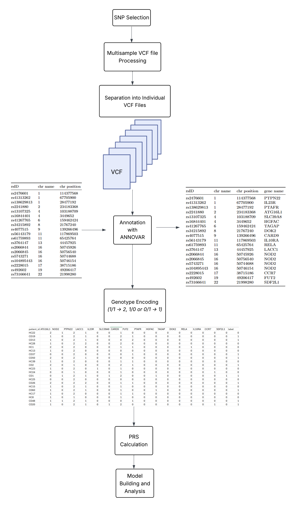

# Leveraging WES Data to Predict Crohn’s Disease: A Case-Control Genomic Study
Crohn’s disease (CD), a category of inflammatory bowel disease (IBD), is a complex trait disease involving multiple susceptibility loci. Early diagnosis of this disease is challenging and can lead to severe or potentially fatal complications, especially when there is no cure for it. Therefore, predictive tools are needed to enable early diagnosis and prevention of this disease. In this study, exome sequencing data from the CAGI4 challenge was used to develop a machine learning model to predict CD status among 111 individuals, based on 19 exonic single nucleotide polymorphisms (SNPs) across 16 genes. After examining different combinations of genes, SNPs located in three genes (NOD2, CARD9, and ATG16L1) yielded high predictive performance along with the polygenic risk score (PGS). Principal Component Analysis (PCA) was performed for dimensionality reduction, and a Random Forest (RF) classifier was applied to the transformed data for binary classification. The model achieved an accuracy of 90% and an area under the curve (AUC) of 0.92. This study provides a valuable and practical tool to help physicians and individuals at risk by allowing early detection of CD based on exome data mutations, aiming to prevent potentially severe outcomes.

## Workflow Adopted

# Explanation of the Workflow

## Dataset and Exome Sequencing
The CAGI4 (2016) Crohn’s disease prediction challenge dataset includes a multisample VCF file comprising 111 individuals, 64 patients with CD and 47 healthy controls, identified after the release of the labels. All exome sequencing data were generated using the TruSeq Exome Enrichment Kit (Illumina, San Diego, CA, USA) and sequenced
on the Illumina HiSeq 2000 platform. Variant calling was performed jointly using the Genome Analysis Toolkit (GATK) HaplotypeCaller (v3.3-0) to minimize potential
data processing artifacts. Read alignment and chromosomal position mapping were carried out using the human genome reference build hg1910.

##  Selection of SNPs for Analysis
In the challenge, the highest-scoring method, achieving an AUC of 0.72, focused on evaluating SNPs within known disease-associated loci. Therefore, in this study, a
comprehensive list of exonic SNPs exclusively related to CD was curated from the literature, as analyzing only NOD2, the first susceptibility gene identified
for Crohn’s disease, proved insufficient. This outcome was expected, given that Crohn’s disease is known to be polygenic. While many SNPs were initially considered,
only those found in the multisample exome sequencing VCF file were selected for further analysis.

## Data Preprocessing
To prepare the dataset for analysis, the multisample VCF file was first separated into individual VCF files, with one file created for each subject included in the study. Filtering was then applied to retain only the SNPs of interest. During this step, variants with a homozygous reference genotype (0/0) were also filtered out to retain only positions carrying at least one alternate allele. Each VCF file was subsequently annotated using ANNOVAR to retrieve the associated gene names of each SNP, which were not
present in the original VCF files. This separation from the multisample VCF file to multiple VCF files was necessary because the subject identification was lost when the
multisample VCF file was processed through ANNOVAR all at once. Genotype data were encoded numerically for downstream analysis. Homozygous alternate genotypes
(1/1) were assigned a value of 2, while heterozygous genotypes (1/0 or 0/1) were assigned a value of 1. For the NOD2 gene, which is represented by multiple SNPs, the genotype values for each SNP were summed to generate a single combined value per subject for that gene. The resulting table summarizes the processed genotypic data
per subject, with rows representing individual subjects and columns corresponding to the selected 16 genes.

##  Polygenic Risk Scores
In addition to the 16 gene-based features, a polygenic risk score (PRS) was included as an additional feature. The PRS was calculated using the Polygenic Score Catalog
Calculator pgsc calc, based on the 19 SNPs selected from the literature. Since not all the chosen SNPs were included in published GWAS results, and some were
identified in studies that extended GWAS findings, a custom scoring file was manually constructed. The effect sizes (weights) for each SNP were extracted directly from the
publications and GWAS in order to build the scoring file. As all effect sizes were derived from studies based on European ancestry populations, and the CAGI4 dataset
used in this study includes individuals of German ancestry, these PRS calculations were considered applicable.The analysis was performed both with and without the PRS to compare which approach would yield better results.

## Data Visualization
After building the table containing the genotype encoding and calculating the polygenic risk score, a box plot was created to compare the distribution of genetic variant
values across the two classes for all features (0: Healthy, 1: CD patients). The eleven genes that lack a visible boxplot distribution likely correspond to SNPs with no observed variation across
all samples. These features are constant and thus not informative for distinguishing between the two labels. Additionally, LACC1 and FUT2 exhibit nearly identical
distributions in both classes, also suggesting that they do not contribute to class differentiation in this dataset. The PRS feature, ranges approximately from 0.15 to 2.6, with a mode occurring around 0.65. Regarding the correlation heatmap, a strong correlation is observed between the PRS and the NOD2 gene (0.76), as well as a moderate correlation with the CARD9 gene (0.58).

## Machine Learning Model Development
Three machine learning models were tested: Logistic Regression, SVM, and Random Forest. Since not all features exhibited a meaningful distribution, feature selection was performed, and multiple gene combinations were tested with and without the PRS to enhance classification performance. After feature selection, PCA was applied as a dimensionality reduction technique to address potential collinearity problems between PRS and the NOD2 and CARD9 genes and to improve the accuracy of the model.

## Clustering Approach
This method is based on the assumption that similar data points should belong to the same cluster. Initially, the data is split into training and testing sets. The training
set is then clustered, and the testing points are subsequently assigned to the existing clusters formed from the training data. Since similar points are likely to fall into the same cluster, each testing point is labeled based on the most frequent class within its assigned cluster. This approach allows for a certain margin of error without significantly affecting the overall performance. Based on the UMAP visualization, which preserves the global structure of the data points, the data does not exhibit
any distinct or structured shape. For this reason, HDBSCAN was chosen as the clustering algorithm. HDBSCAN is a density-based method, well-suited for discovering
clusters in datasets without clear structure, as it does not assume any specific distribution of the data. Clustering was also performed with and without the PRS, to
generate the best performing model using this approach.

## Results 
Out of the three classification models built, the selected best-performing model was the Random Forest classifier, which was trained on the first two principal components
resulting from a PCA performed on the three gene features—ATG16L1, NOD2, and CARD9—along with the PRS. The chosen genes were justified based on their distinctlydifferent distributions between healthy controls and Crohn’s disease patients. The model achieved an accuracy of 95.65% and an AUC of 0.92. The first two principal components explained 39.2% and 31.7% of the total variance, respectively. Regarding the clustering approach, incorporating the PRS feature did not improve the model’s prediction accuracy. The genes that contributed to the best-performing model were: ATG16L1, NOD2, PTPN22, LACC1, SLC39A8, CARD9, FUT2, HGFAC, DOK2, and CCR7. These genes were identified as the most important features by the RF model, while the other genes had an importance score of 0. For clustering, the minimum cluster size was set to 10, and the minimum samples, which is the minimum number of neighbors to a core point, was set to 1. These parameters were selected after testing various combinations as they yielded the best performance. However, this model still did not outperform the RF model, achieving an accuracy of 78.26% and an AUC of 0.77.

